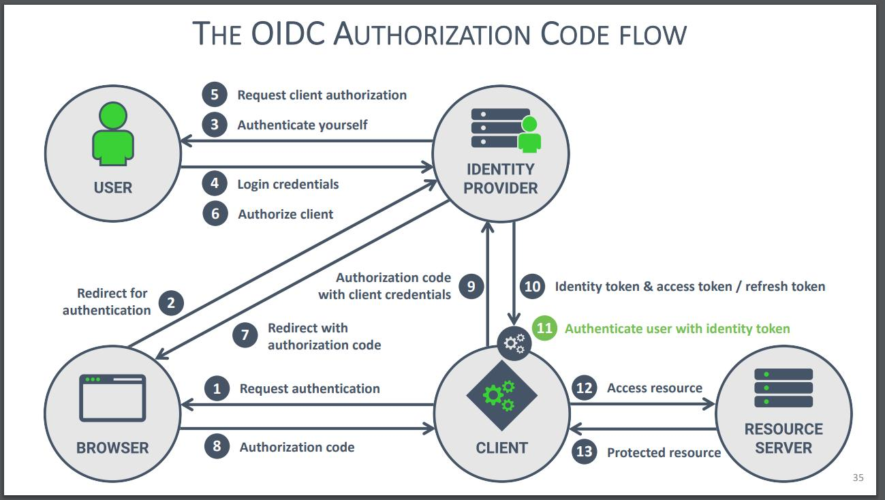

**Tài khoản tạo trên Keycloak sẽ kết nối đến Grafana, Jenkins, Gitea như thế nào?. Cùng 1 tài khoản A nhưng ở các hệ thống khác nhau có password thì Keycloak xử lý như thế nào.**

Keycloak ko đăng nhập hộ các ứng dụng theo kiểu chia sẻ 1 password mà nó đóng vai trò Idp (Identity provider) trung tâm, còn một hệ thống là một OIDC client riêng.

Khi tạo một user trong 1 realm ở keycloak thì user đó tồn tại trong realm đó trong keycloak. Keycloak nắm giữ credentials của user và thực hiện authentication. Khi một ứng dụng (Grafana, Jenkins, Gitea...) cần xác nhận user thì sẽ chuyển sang keycloak để xác thực user rồi trả authorization code về client để đổi lấy token. Việc login của người dùng sẽ đi qua keycloak chứ ko login với ứng dụng nên mọi ứng dụng sử dụng keycloak OIDC sẽ dùng chung thông tin credentials.

Khi tài khoản A login ở Grafana, nếu Grafana sử dụng Keycloak OIDC để thực hiện auth thì khi login, Grafana sẽ điều hướng browser sang Keycloak. Người dùng thực hiện login ở trang của Keycloak -> password được gửi tới keycloak trong quá trình authen chứ ko phải Grafana. Keycloak xác thực và nếu thành công (user password đúng), gửi authen code về Grafana. Grafana dùng code này để lấy token từ Keycloak (Authentication code flow). Token sẽ lấy những thông tin trong token như user, email, tên... để tạo nên profile của người dùng trong ứng dụng, ko cần biết password của user.

Sau khi đã đăng nhập ở 1 trong các ứng dụng này rồi thì khi vào các ứng dụng khác cũng sử dụng Keycloak OIDC authorization, có thể ko cần thực hiện nhập credentials lại nữa nếu browser vẫn còn keycloak SSO session. Khi ứng dụng redirect sang keycloak để login, keycloak sẽ kiểm tra xem browser đã có authenticate user nào chưa để hoàn tất quá trình login mà ko yêu cầu nhập lại password (Single Sign-On)

=> Password thuộc về keycloak, ko thuộc về ứng dụng.

