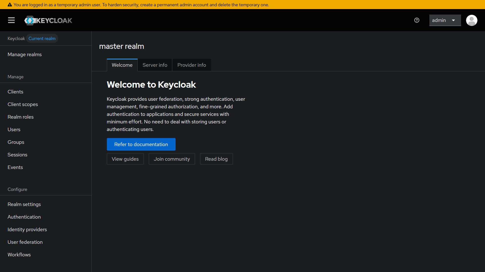
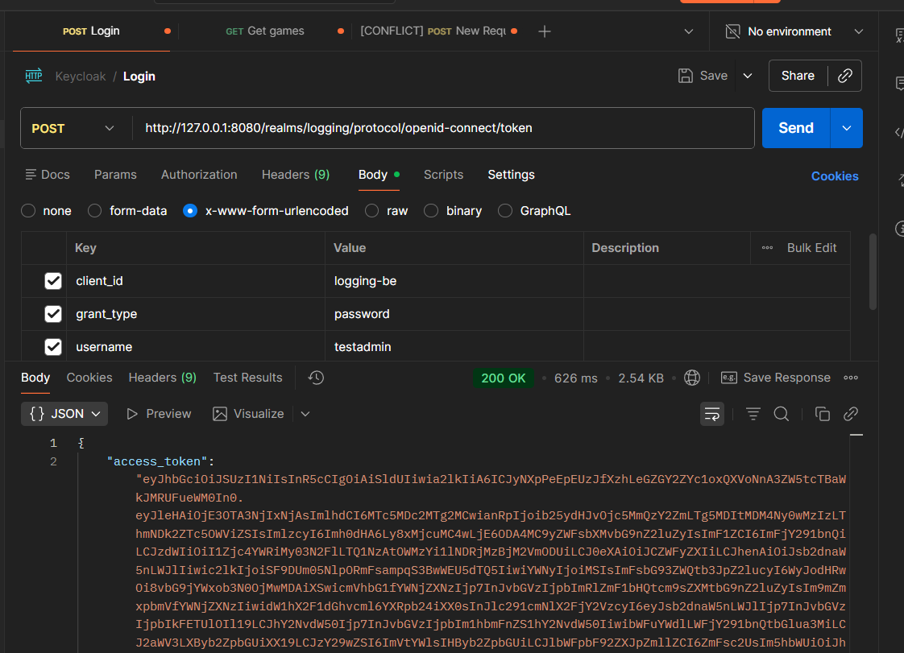
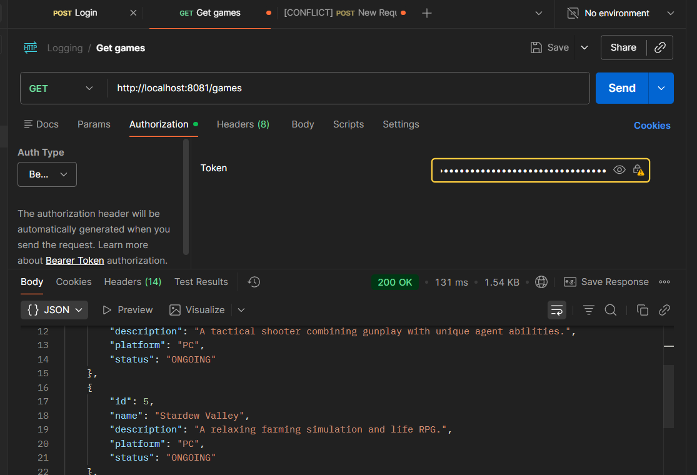

**Tìm hiểu về Keycloak**

Keycloak là một giải pháp quản lý danh tích tập trung mã nguồn mở (Identity and Access Management), cung cấp giải pháp đăng nhập một lần (SSO), quản lý danh tính và quyền truy cập cho các ứng dụng và dịch vụ. 

Mục tiêu của Keycloak là đơn giản hóa bảo mật, giúp dev dễ dàng tích hợp các tính năng security vào ứng dụng mà không cần phải tự xây dựng từ đầu. Những tính năng này được cung cấp sẵn, có thể tùy chỉnh linh hoạt để phù hợp với từng tổ chức.

Cụ thể Keycloak giúp ứng dụng xử lý:

- Đăng nhập một lần (SSO), chỉ cần đăng nhập 1 lần để sử dụng nhiều ứng dụng.
- Đầy đủ các tiêu chuẩn xác thực hiện đại như OAuth2, OIDC, SAML 2.0...
- User Management: Tạo user, nhóm, vai trò, đặt password policy, khóa tài khoản, TOTP/2FA…
- Cho phép đăng nhập bằng Google, Facebook, Github…
- Phân quyền theo role hoặc theo resource.
- Admin Console và Account Console: Giao diện trực quan giúp quản lý dễ dàng.

Dev ko cần tự implement những chức năng này mà Keycloak sẽ đảm nhiệm hết. Ứng dụng chỉ chịu trách nhiệm verify xem đoạn token có hợp lệ hay ko, user có quyền truy cập API này hay ko.

**Các thành phần chính của Keycloak**

Realm: một không gian làm việc độc lập trong Keycloak, mỗi realm quản lý các user, role, group và ứng dụng riêng biệt. Một admin keycloak có thể quản lý nhiều realm khác nhau.

Client: đại diện cho các ứng dụng hoặc dịch vụ được bảo mật bởi Keycloak. Mỗi client có cấu hình riêng như giao thức (OAuth2, OpenID Connect), URL dùng để callback, thông tin bảo mật, role...

User: cá nhân hoặc hệ thống truy cập vào ứng dụng. User được gán role để xác định quyền truy cập. Keycloak hỗ trợ nhiều phương pháp xác thực tài khoản như đăng nhập bằng email/username và mật khẩu, đăng nhập qua tài khoản bên thứ 3 (Google, FB...), xác thực 2 yếu tố...

Role: quản lý quyền truy cập của các tài khoản. Có 2 loại role được Keycloak sử dụng là realm role và client role. Client role là role ở cấp độ ứng dụng còn realm role ở mức độ cao hơn là realm.

Token: Keycloak sử dụng token để xác thực và ủy quyền, bao gồm access token được gửi cùng với các yêu cầu đến ứng dụng để xác minh người dùng, id token chứa thông tin về danh tính của người dùng và refresh token dùng để lấy access token mới khi token cũ hết hạn.

**Mô hình hoạt động của Keycloak**

- Người dùng truy cập ứng dụng và yêu cầu access resource của ứng dụng.
- Nếu chưa login, ứng dụng điều hướng người dùng tới Keycloak để thực hiện xác thực.
- Người dùng thực hiện login. Nếu xác thực thành công, Keycloak sẽ tạo các token.
- Ứng dụng nhận token từ Keycloak và lưu lại (thường trong cookie hoặc localstorage).
- Khi người dùng yêu cầu resource như API, ứng dụng gửi access token kèm theo yêu cầu để xác minh danh tính.
- Keycloak xác minh token, kiểm tra role và trả về ứng dụng nếu người dùng có quyền.

**Setup Keycloak cơ bản**

Có thể chạy Keycloak bằng nhiều cách khác nhau: chạy trực tiếp trong server sử dụng OpenJDK hoặc chạy trong môi trường container như Docker, Kubernetes, Podman, OpenShift... Cách đơn giản nhất là sử dụng Docker để chạy Keycloak trong môi trường độc lập.

Để chạy trong Docker, run command sau:

```
docker run -p 127.0.0.1:8080:8080 -e KC_BOOTSTRAP_ADMIN_USERNAME=admin -e KC_BOOTSTRAP_ADMIN_PASSWORD=admin quay.io/keycloak/keycloak:26.7.4 start-dev
```

- Có thể đổi sang port khác nếu bị conflict với các ứng dụng khác.
- Khởi tạo username và password của tài khoản admin tạm thời.
- Ở địa chỉ localhost, local private IP (10.x.x.x) hoặc loopback address (127.0.0.1) thì Keycloak mới cho phép HTTP traffic. Nếu chạy ở các địa chỉ public, Keycloak chỉ nhận kết nối HTTPS để đảm bảo bảo mật. Nếu vẫn muốn kết nối với Keycloak ở địa chỉ public sử dụng kết nối HTTP thì cần tạm thời tắt requirement HTTPS ở realm master như sau:

```
docker exec -it <container_name_or_id> bash
cd /opt/keycloak/bin
./kcadm.sh config credentials --server <server> --realm master --user <ADMIN_USER>
./kcadm.sh update realms/master -s sslRequired=NONE
```

Ko nên sử dụng Keycloak ntn ngoài môi trường test do rủi ro bảo mật.

Sau khi container đã chạy, truy cập địa chỉ URL và đăng nhập bằng tài khoản admin tạm thời. Giao diện chính của Keycloak:



Để kết nối Keycloak với ứng dụng, nên tạo một realm mới riêng thay vì sử dụng realm master. Chọn Manage Realm -> Create Realm, chọn tên realm và Create. 

Trong realm vừa tạo, thực hiện tạo client mới. Chọn tên client (client id), client type (default là OpenID Connect). Ở capability config, nên để default (có thể chọn thêm direct access grant để thực hiện test token endpoint của keycloak).

- Root URL là địa chỉ URL gốc của ứng dụng.
- Home URL là địa chỉ default để auth server redirect tới.
- Valid redirect URI là pattern URI mà Keycloak có thể redirect tới sau khi login.
- Valid post logout redirect URI là pattern URI mà Keycloak có thể redirect tới sau khi logout.
- Web origins là những địa chỉ domain được cho phép qua CORS.

Sau khi tạo client, cần tạo một số user để test. Vào Users -> Create User, nhập các thông tin cơ bản và lưu. Tại tab credentials, đặt mật khẩu và tắt temporary nếu ko muốn người dùng phải đổi mật khẩu sau lần đầu đăng nhập. Để set realm roles hoặc login roles, cần tạo roles trước.

- Realm role: Vào Realm roles -> Create role, nhập tên role và tạo.
- Client role: Vào Clients -> Client cụ thể, vào tab Role -> Create role và tạo role.

Sau đó vào Users -> User cụ thể -> Role mapping và chọn role cho user account.

**Tích hợp Keycloak vào ứng dụng**

Thực hiện tích hợp Keycloak vào logging-be chạy Spring Boot. Thêm các dependency sau vào pom.xml và reload:

```
    <dependency>
        <groupId>org.springframework.boot</groupId>
        <artifactId>spring-boot-starter-oauth2-resource-server</artifactId>
    </dependency>
    <dependency>
        <groupId>org.springframework.boot</groupId>
        <artifactId>spring-boot-starter-security</artifactId>
    </dependency>
```

và thêm vào trong application.properties:

```
spring.security.oauth2.resourceserver.jwt.issuer-uri=http://127.0.0.1:8080/realms/logging
```

- Trỏ Spring Boot tới địa chỉ resource server thực hiện nhận và gửi JWT là server Keycloak.

Backend ngoài việc serve API và resource tới người dùng thì sẽ còn đảm nhiệm nhiệm vụ phân quyền cho các API và verify token. Để thực hiện điều này cần tạo một SecurityConfig: [SecurityConfig.java](SecurityConfig.java)

- Xác định API nào cần authentication.
- Xác định role nào được phép truy cập API nào.

Trong config có sử dụng một converter [KeycloakJwtAuthenticationConverter.java](KeycloakJwtAuthenticationConverter.java):

```
                .oauth2ResourceServer(oauth2 -> oauth2
                        .jwt(jwt -> jwt
                                .jwtAuthenticationConverter(
                                        new KeycloakJwtAuthenticationConverter()
                                )
                        )
                );
```

- Keycloak sẽ trả access token dưới dạng JWT (Json web token). Spring Security đọc được JWT nhưng nó cần chuyển thông tin trong JWT thành dạng GrantedAuthority (ROLE_USER, ROLE_ADMIN...). Converter sẽ lọc role (realm role hoặc client role) từ đoạn JWT và tạo authentication. Config sử dụng kết quả này để quyết định có được gọi API hay ko.

Khởi động ứng dụng. Để test xem Keycloak có hoạt động hay ko, có thể sử dụng Postman để kiểm tra API auth.



Sử dụng đoạn token được trả ra làm bearer token khi thực hiện request API:




